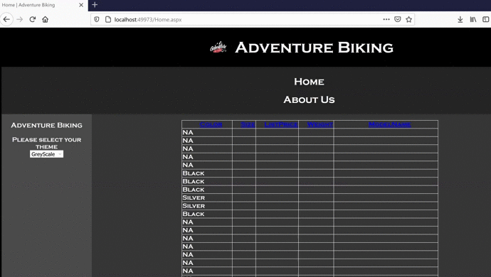

# AdventureBikingWThemes

A website prototype(ASP.NET) that connects to the AdventureWorks database hosted in Azure. The AdventureWorks database contains product information on equipment related to adventure biking. 

The website prototype has been built on ASP.NET Web Pages (.aspx Extension coded in C#). The prototype includes a Master Page, 2 Web Pages, a Navigation Bar, Implementation of two different Themes, Styling using CSS, a web.config(Database Source) file, A Gridview which can display and sort the data fetched from the database and proper coding conventions.

